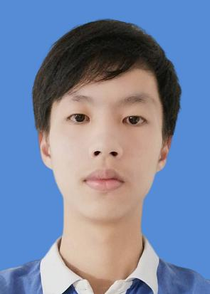
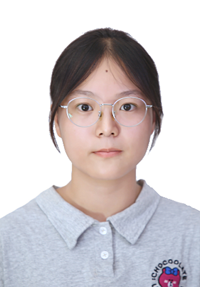

# Software_Engineering_Course
软件工程课程
# 组员介绍

## 组员1: 颜润鑫

### 自我简介
华中师范大学计算机学院2022级本科生

### 项目经历
- **项目名称：Chatting区域聊天软件 C++应用开发**
  - 项目简述：基于局域网的多人在线聊天系统，支持实时文字聊天、群组通信、文件传输等功能，旨在提升团队协作效率。
  - 技术栈：C/C++、Socket、多线程、MySQL。
  - 项目职责：项目组长、产品经理、全栈开发。
  - 项目成果：2023年华中师范大学计算机学院2022级本科生产实习项目评分第一；2023年华中师范大学计算机学院2022级本科生产实习“个人优秀奖”。
- **项目名称：大学生数字化成长智能驾驶舱 Web项目开发**
  - 项目简述：项目通过构建大学生能力量化体系，结合数据驾驶舱、知识图谱、推荐算法等技术，设计并实现了一个大学生综合素质测评系统，旨在为大学生提供个性化的能力评估与成长建议。
  - 技术栈：Python、Django框架、Vue.js、sigma.js、Pandas、MySQL。
  - 项目职责：项目负责人、全栈开发。
  - 项目成果：2024年（第17届）中国大学生计算机设计大赛国赛“二等奖”；计算机软件著作权登记证书（“数字赋能，分毫析厘”——大学生数字化成长智能驾驶舱系统）；2024年（第17届）中国大学生计算机设计大赛中南地区赛“一等奖”。

### 获奖情况
- 2023年华中师范大学计算机学院2022级本科生产实习“个人优秀奖”；
- 2022-2023学年度华中师范大学计算机学院2022级本科生“三好学生”；
- 2022-2023学年度华中师范大学本科生“优秀学生干部“；
- 2023年华中师范大学“博雅树人奖学金”（博雅丹桂奖学金）；
- 2023年华中师范大学“优秀共青团干部”；
- 2024年（第17届）中国大学生计算机设计大赛中南地区赛本科组“一等奖”；
- 2024年（第17届）中国大学生计算机设计大赛国赛“二等奖”；
- 2024年荣耀星辉贡献奖；
- 2024年华中师范大学“博雅树人奖学金”（博雅丹桂奖学金）；
- 2023-2024学年度华中师范大学计算机学院2022级本科生“三好学生”；
- 2024年（第二届）全国大学生职业规划大赛华中师范大学校赛就业赛道“优秀奖”。

### 其他优势
- 行业前沿敏锐度：积极参加各类开发者大会及产品发布会，与研发工程师深入交流，对行业前沿技术拥有着较为深刻的理解并保持着高度热情；
- 快速学习与实践能力：具备极强的学习能力，能在零基础情况下通过项目实践快速掌握新技术，独立完成开发任务并推动项目迭代；
- 高效响应与应变能力：对用户需求变更反应迅速，能在短时间内调整方案并落地实施，确保项目进度与质量。

------

## 组员2：钟苏琴

### 自我介绍

华中师范大学计算机学院计算机科学与技术专业2022级本科生

### 项目经历

- **项目名称：智瞳——基于yolo5s的作弊监测系统**
  - 项目简述：该项目可以实时监测考场上学生的异常行为，包括左顾右盼、低头作弊、传纸条等；并提供试后复查机制，考生可在我们的平台举报作弊行为，审查员审查后进行结果的公示。
  - 技术栈：python，PyQt5，yolo5s。
  - 项目职责：前端开发。

### 获奖情况

- 2023年全国大学生英语竞赛全国三等奖；
- 2022-2023学年度华中师范大学计算机学院2022级本科生“三好学生”；
- 获得2023年国家励志奖学金；
- 2023-2024学年度华中师范大学计算机学院2022级本科生“三好学生”；
- 获得2024年华中师范大学博雅丹桂奖学金；
- 获得2024年华中师范大学逸华励志奖学金。

### 个人优势

- 人工智能方面：曾学习Transformer在多模态融合中的应用，协助复现CMU-MOSI数据集的基线模型。
- 学习能力方面：曾专研过多模态一段时间，能快速消化多模态领域前沿论文，善于在复杂技术框架中提炼核心方法论。

------

## 组员3：周锦

### 自我简介

华中师范大学计算机学院2022级本科生。

### 项目经历

项目名称：“花语智农”——油茶林智能授粉系统

项目简述：通过yolov5目标识别油茶花，使用自主设计的无人机智能喷洒花粉，实现油茶林的精确授粉。

技术栈：华为云等系列技术，yolov5目标识别，django

项目职责：Web开发

### 获奖情况

- 2022-2023华中师范大学计算机学院“三好学生”；
- 2022年华中师范大学博雅丹桂奖学金；
- 2023年全国大学生数学建模大赛省三等奖；
- 2023全国第十四届亚太地区大学生数学建模竞赛省二等奖；
- 2023-2024华中师范大学计算机学院“三好学生”；
- 2024年华中师范大学博雅丹桂奖学金；
- 2024全国大学生英语竞赛省三等奖；

### 其他优势

- 团队协作与沟通能力：具备良好的团队协作能力，能够清晰地表达团队技术方案，确保项目的有效进行；
- 学习和适应能力：能够迅速掌握新技术，保持对前沿技术的关注，增强个人竞争力；